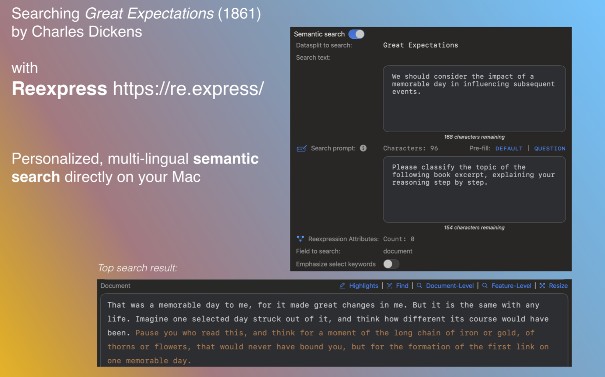
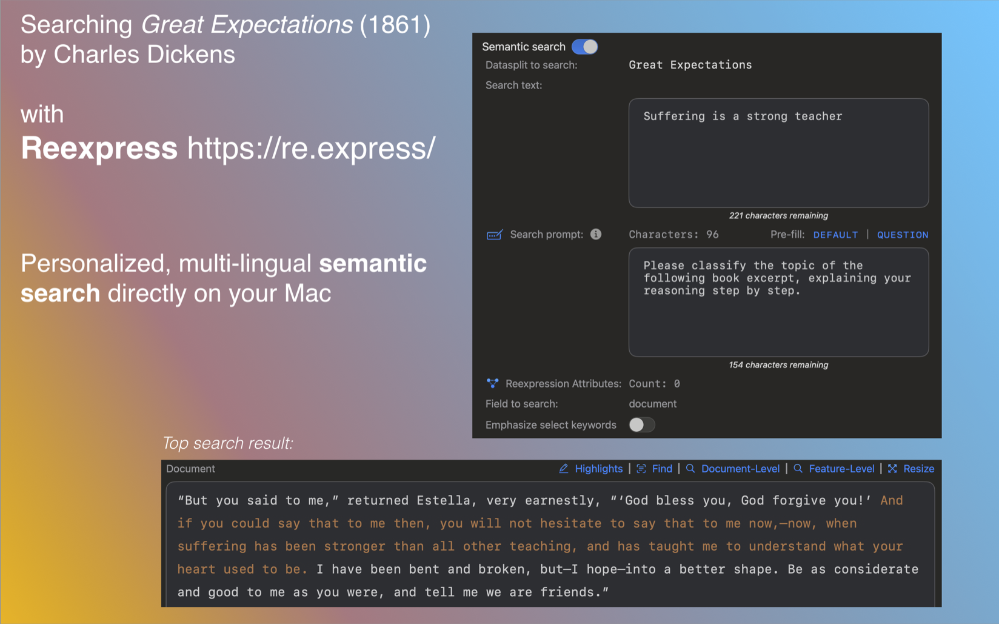
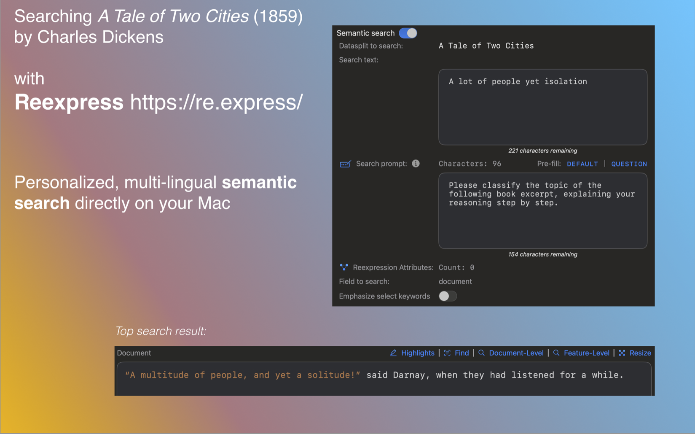
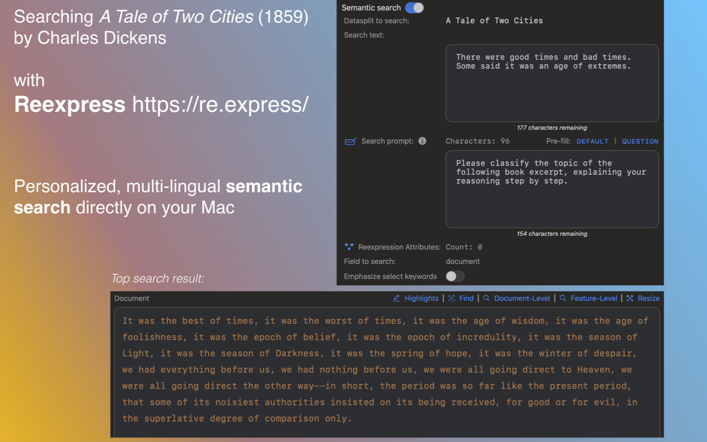

# Tutorial 4: Semantic Search without Labeled Documents

[Reexpress](https://re.express/) makes it super easy to run advanced semantic searches directly on your Mac. With the classification examples in Tutorials 1-3, after training the model we can run semantic searches by going to *Explore*->*Select*->*Semantic Search*. Unlike alternative options from other applications and cloud APIs, the dense (vector) representations used in the search are trained against your data, which can greatly boost the quality of the search results. Additionally, with Reexpress you have far more control than other approaches in controlling the search via label-, prediction-, keyword-, reliability-, and other constraints.

However, this presumes a document classification task. What if we want to search our enterprise or personal documents, rather than those from an existing classification task? How would we train the model to even get started since we don't have document labels?

In fact, it is almost always easy to come up with *naturally occurring labels* to transform your documents so that you can train your custom model and run semantic searches with Reexpress. For example, if you have emails, you might consider creating a binary classification task by separating the emails by those from your contacts and those from addresses not in your contacts, or before and after one particular point in time. With enterprise documents, you might consider separating by those associated with one set of departments and those from the remaining set of departments. Here, the aim is not necessarily to then assign predictions to new unseen documents, but to provide a synthetic contrast with which to train a model.

And if it isn't possible to readily split your data (e.g., metadata is missing or splitting would result in small sets), consider using another unrelated document set as the opposing label (e.g., Wikipedia documents, or one or more Project Gutenberg books as we do here).

In this tutorial, we'll train a model so that we can search two books by Charles Dickens: *Great Expectations* (1861) and *A Tale of Two Cities* (1859). To do so, we'll simply assign label 0 to passages from *Great Expectations* and label 1 to passages from *A Tale of Two Cities*, split into Training and Calibration sets, import to Reexpress, train, and then we can run no-code semantic searches. Here, the actual classification between the two books isn't the focus (after all, we have the labels!), but setting up this contrast enables training a model to enable search personalized to the data.

## Data download

First, download the raw text (Plain Text UTF-8) of the books from Project Gutenberg. Go to the following URLs and click File->Save in your browser:

[Great Expectations](https://www.gutenberg.org/cache/epub/1400/pg1400.txt)

[A Tale of Two Cities](https://www.gutenberg.org/cache/epub/98/pg98.txt)


## Preprocess data into the JSON Lines format

Next, run the [preprocessing script](preprocess/semantic_search.py) as follows, updating the global constants INPUT_DATA and OUTPUT to reflect the location of the files downloaded above and the desired output directory, respectively. The script will simply separate the books into individual "documents" by presence of newlines.

```
INPUT_DATA=".../books"
OUTPUT=".../semantic_search_books_example"
mkdir -p ${OUTPUT}

# constants used below
BOOK0="Great Expectations"
BOOK0_FILENAME="pg1400.txt"
BOOK0_LABEL=0
BOOK1="A Tale of Two Cities"
BOOK1_FILENAME="pg98.txt"
BOOK1_LABEL=1
TEXTPROMPT="Please classify the topic of the following book excerpt, explaining your reasoning step by step."

# first book

python -u semantic_search.py \
--input_data_txt ${INPUT_DATA}/"${BOOK0_FILENAME}" \
--book_label "${BOOK0}" \
--prompt "${TEXTPROMPT}" \
--label_int ${BOOK0_LABEL} \
--split_into_training_and_calibration_sets \
--output_directory ${OUTPUT}

# second book

python -u semantic_search.py \
--input_data_txt ${INPUT_DATA}/"${BOOK1_FILENAME}" \
--book_label "${BOOK1}" \
--prompt "${TEXTPROMPT}" \
--label_int ${BOOK1_LABEL} \
--split_into_training_and_calibration_sets \
--output_directory ${OUTPUT}


# The following is not strictly required, but to avoid manually searching twice across datasplits (Training and Calibration), we will also
# create another copy of the data with all of the text for a book in a single file. Since the UUID's will be unique
# for each document, we can safely upload these files into separate eval datasplits without overwritting the duplicates
# in Training and Calibration. We do this by ommitting the flag --split_into_training_and_calibration_sets

# first book

python -u semantic_search.py \
--input_data_txt ${INPUT_DATA}/"${BOOK0_FILENAME}" \
--book_label "${BOOK0}" \
--prompt "${TEXTPROMPT}" \
--label_int ${BOOK0_LABEL} \
--output_directory ${OUTPUT}

# second book

python -u semantic_search.py \
--input_data_txt ${INPUT_DATA}/"${BOOK1_FILENAME}" \
--book_label "${BOOK1}" \
--prompt "${TEXTPROMPT}" \
--label_int ${BOOK1_LABEL} \
--output_directory ${OUTPUT}
```

The above will produce the following files (total documents in parentheses):

- (1663) A Tale of Two Cities_training.jsonl
- (1664) A Tale of Two Cities_calibration.jsonl
- (3327) A Tale of Two Cities_complete.jsonl
- (1957) Great Expectations_training.jsonl
- (1958) Great Expectations_calibration.jsonl
- (3915) Great Expectations_complete.jsonl


## Create the project file in Reexpress

Open Reexpress and create a new project with 2 classes. Choose the Faster I model (1.2 billion parameters). We included a prompt in the JSON lines file above, but go ahead and set a default prompt so that you can just click "Default" to auto-fill the prompt when running searches. Choose "Custom" as the default prompt type and fill in the box with the same prompt as above: `Please classify the topic of the following book excerpt, explaining your reasoning step by step.`

After creating the project, in *Data*->*Overview* select *Rename* on the `Validation set` card and rename it to "A Tale of Two Cities". Similarly, select *Rename* on the `Eval set` card and rename it to "Great Expectations". This will just make it a bit easier to keep track of which documents are from which book.

Next, upload the documents by going to *Data*->*Overview* and clicking *Add* on any one of the datasplit cards. Import the JSON lines files to the following datasplits:

- A Tale of Two Cities_training.jsonl -> **Training set**
- Great Expectations_training.jsonl -> **Training set**
- A Tale of Two Cities_calibration.jsonl -> **Calibration set**
- Great Expectations_calibration.jsonl -> **Calibration set**
- A Tale of Two Cities_complete.jsonl -> **A Tale of Two Cities**
- Great Expectations_complete.jsonl -> **Great Expectations**

Next import the [label display names file we provide](resources/label_display_names.jsonl) by going to *Data*->*Labels* and click Upload.

## Train the model

Go to *Learn*->*Train*->*Batch* and set the `Max number of epochs` for both the base model and model compression to `200`, and keep the other options at the default values. Next, scroll down to `Choose datasplits for post-training inference` and *Select All* to auto run inference once training is complete. Click through continue and let training begin.

Training and inference will take around 24 minutes on a M2 Ultra 76 core Mac Studio with 128gb of RAM. And that's it...you're ready to search!

## Search examples

Running a semantic search is then as simple as going to *Explore*->*Select*->*Semantic Search* and adding search text. Remember to add a prompt. Typically this should be the same as that used in training; since we added a default prompt when creating the project, this is as simple as clicking `Pre-fill Default`. (Once you've added search text, the icon in front of "Search prompt" will turn blue and you can modify the prompt, if desired, but typically that's not needed.)

Also, remember to specify the Datasplit in the dropdown in *Explore*->*Select*. Here, we can just use our convenience sets we created above, "A Tale of Two Cities" and "Great Expectations" that only have documents for a single label. If we want to instead just directly search the Training or Calibration sets, we can easily constrain to the labels of interest: Just go to *Explore*->*Select*->*Constraints* and choose the ground-truth labels of interest. 

Here are two examples from each of the books with the top (first) document result. The orange text is the section detected as the most relevant within the returned document:

### Great Expectations

Search text: "The impact of a memorable day":



Search text: "Suffering is a strong teacher":



### A Tale of Two Cities

Search text: "A lot of people yet isolation":



Search text: "There were good times and bad times. Some said it was an age of extremes.":




## Additional search options

We've only scratched the surface of what's possible with semantic search with Reexpress. For example, you can emphasize particular keywords to alter your search intent (in *Explore*->*Select*->*Semantic Search* enable the toggle for "Emphasize select keywords" and then just click on any keyword). You can also combine a semantic search with the constraints in the other tabs in *Explore*->*Select*.

Try it out for yourself on your own documents! 
