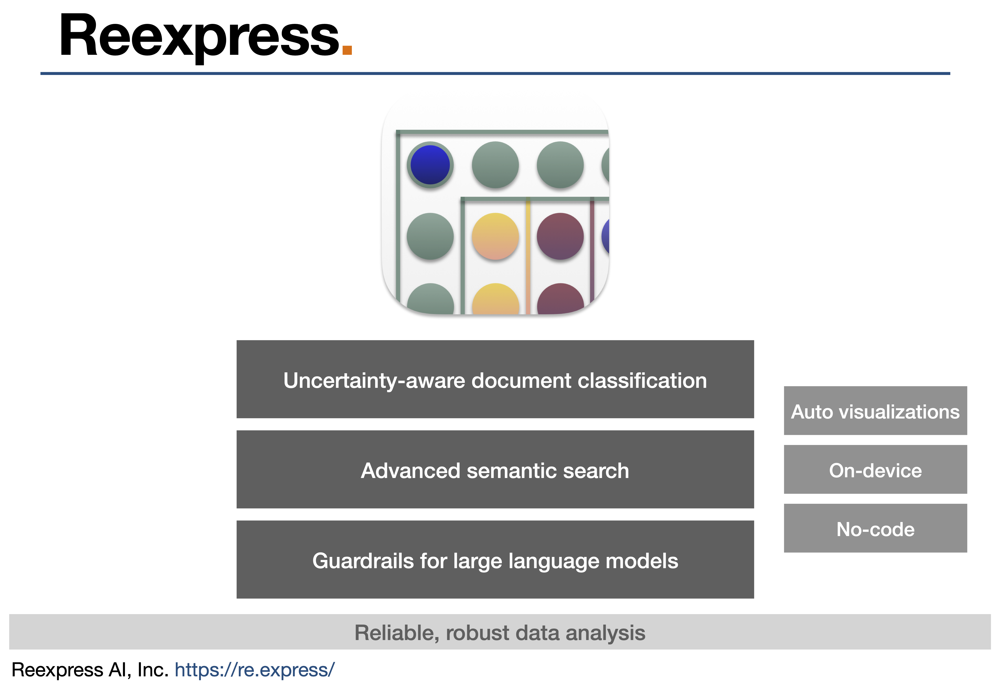
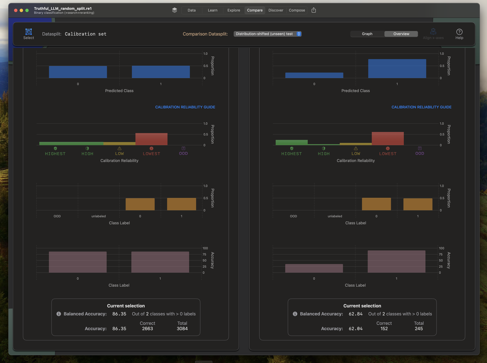
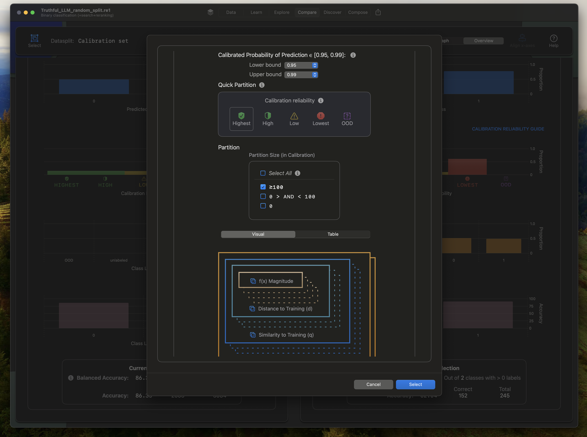
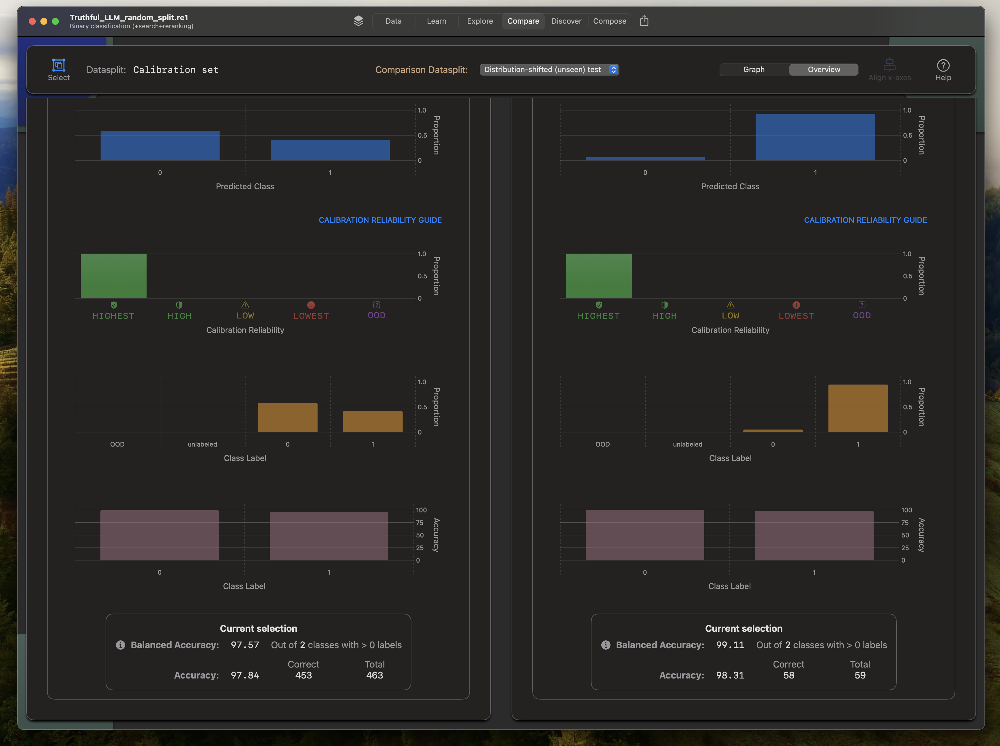

# Tutorial 7: Reexpress is your reliable co-pilot for enterprise and professional AI-augmented data analysis

### Video overview: [Here](https://youtu.be/ipSZf3h8vLY)

As we saw in Tutorial 6, [Reexpress](https://re.express/) can be used to add uncertainty quantification, search, and auto-visualization capabilities to essentially any generative AI language model. This newfound ability to derive reliable and robust uncertainty estimates from neural networks, over high-dimensional inputs, is very powerful and general. Progress can be made on challenging tasks such as fact verification and hallucination detection by casting them as classification for input into Reexpress. Importantly, in addition to being an end-to-end, no-code solution that you can download and use today on your Mac, the underlying Reexpress method is more advanced and reliable than more recently proposed alternatives in the academic literature, as we illustrate in this tutorial.

Recent academic work ([[1], [2], inter alia.](#references)) has sought to extract latent signals within parametric neural networks that are correlated with truthfulness. The goal is to construct a semi- or distantly-supervised classifier over these signals for use in reducing hallucinations and other errors from large language models. The methods are premised on the idea that large networks encode signals for binary truthfulness in their hidden states, and these latent signals can be extracted via a transform of the hidden states.

**In fact, the older idea that is Reexpress is more powerful and general than this.** Reexpress is premised on the older and more general result that parametric neural networks can be closely approximated as a transformation of their hidden states over the observed training data [[3]](#references). Reexpress takes this line of work to its logical conclusion: By reexpressing a model (or a composition of models, as we'll do in this tutorial) as a direct connection between the observed training and calibration sets, we can add the missing properties needed to use neural networks in practice:

- Introspection
  - Interpretability by example/exemplar: The parameters of the network(s) are non-identifiable, but we can relate predictions to instances with known labels in feature space. 
- Updatability
  - Localized modifications without a full re-training via direct label modification in Training and Calibration. (This is orthogonal to, and can be used in conjunction with, retrieval and localized representation fine-tuning.)
- Uncertainty
  - Reliable and robust uncertainty estimates by controlling for Similarity ⧉ Distance ⧈ Magnitude ⧇ data partitions.

In this tutorial, we focus in particular on the Uncertainty property of Reexpress, with an emphasis on its robustness to distribution shifts across the data partitions. A small example is sufficient to demonstrate that Reexpress is not only convenient given its no-code, visual interface, but also that it is essential in enterprise and professional settings.

## Fact verification

Task:

> Determine whether a statement is true or false.

We will use the SAPLMA data from [1], which consists of single sentence statements that the model is then tasked with classifying as true or false. A final held-out test set is then constructed by having an LLM generate a statement continued from a true statement not otherwise in the dataset. These test statements are checked manually and assigned labels by human annotators. An important observation in [1] is that accuracy is dramatically lower on this generated, held-out test set. That is, the held-out test set is distribution-shifted relative to the training data. Distribution-shifts are common in real-world applications, and as with this data, it is not always immediately obvious to the naked eye that the data is substantively different than the training data. In this case, the test sentences would seem to also be simple true/false statements, but instead the model goes off the rails on this distribution.

If we fine-tune (or re-calibrate) based on a new distribution, we can typically improve accuracy over new samples from the new distribution. However, that begs the obvious question: How would we even know the new unseen data is distribution-shifted in the first place since we wouldn't have ground-truth labels? (After all, we're using the model to predict over this new data!) *The answer is you wouldn't know unless you had Reexpress.* This is why Reexpress is a dramatically more powerful (and fundamentally different) idea than alternative approaches in the literature.

Let's look at this in practice.

## Training Reexpress for fact verification

As in [Tutorial 6](/tutorials/tutorial6_mlx/README.md), we compose the on-device model (in this case, **Fast I**, a multi-lingual model with 3.2 billion parameters) with attributes derived from a simple re-ask verification over `Mixtral-8x7B-Instruct-v0.1`. See [preprocess/README.md](preprocess/README.md) for how to run inference with the Mixtral model and format the attributes in the JSON lines files. That basic setup can be used for other classification tasks, so you can use that as a starting point for your own data. However, for the purposes of this tutorial, you can skip the preprocessing step, as the preprocessed data with attributes is available for download in the archive [data/saplma_true_false_data_with_mixtral_instruct_v0.1.zip](data/saplma_true_false_data_with_mixtral_instruct_v0.1.zip). (Alternatively, if you want to altogether skip the training process, you can download the `.re1` file directly via the link at the end of this section.)

Create a new project in Reexpress. Choose the **Fast I** (3.2 billion parameter) model and use the following prompt: 

> Please classify the correctness of the information in the following document.

The basic pattern here holds for any random split of the data. For reference, the split used here is the following:

| Filename | Datasplit |
| --- | --- |
| `cities_true_false.csv.attributes.jsonl` | Training |
| `elements_true_false.csv.attributes.jsonl` | Training |
| `facts_true_false.csv.attributes.jsonl` | Training |
| `inventions_true_false.csv.attributes.jsonl` | Calibration |
| `companies_true_false.csv.attributes.jsonl` | Calibration |
| `animals_true_false.csv.attributes.jsonl` | Calibration |

The held-out eval set is `generated_true_false.csv.attributes.jsonl`. (In the video, and below, we've renamed this Eval set to "Distribution-shifted (unseen) test". To rename a datasplit in Reexpress, go to **Data** and click *Rename* on the applicable datasplit.)

After importing the above files, optionally upload the label display names file, `label_dislay_names.jsonl`.

Click **Learn**->**Train**->**Batch** and choose 200 epochs for `Model training` and `Model compression`. Scroll down and select the Eval set to automatically run post-training inference. And then start! This will take around 30 minutes on an M2 Ultra 76-core GPU with 128 GB of memory. (Expect around 2x longer on an M1 Max with 64 GB of memory.)

For reference, we provide the `.re1` model file with the trained model and data splits used for this tutorial [here](https://drive.google.com/file/d/1D8SeRDiqz2QPM1dpIbrSiYOFlQCGYK4S/view?usp=sharing). The model file is compressed as a `.zip` file, which is about 200 MB. Uncompress the file by double-clicking it in your Mac's Finder. The uncompressed `.re1` file is about 270 MB.

## Analyzing the output

Go to **Compare** and **Select** the Calibration set. On our run, the Balanced Accuracy is 86, which seems promising given the non-triviality of the task. Great. Let's now evaluate our held-out test. Oh, no! As with the paper [1], the test accuracy has dropped dramatically to the 60s, as displayed in the screenshot below (Calibration set, *left*, Eval set, *right*).

As in [1], one approach would be to fine-tune/re-calibrate over this new distribution. However, that wouldn't in itself be sufficient in real settings, since we would then be caught off guard on the next distribution shift.

Luckily, with Reexpress we can altogether avoid being caught off guard in the first place. And we don't even have to write any additional code to enable this critical guardrail! The calibration method in Reexpress is robust to distribution shifts across the data partitions, and we can utilize the second-order estimate of calibration reliability to further restrict to the data over which the calibration process itself is most reliable. For example, we can restrict to the documents with a calibrated probability in [0.95, 0.99] among those in the Highest calibration reliability partition:

Unlike the massive discrepancy in accuracy between the Calibration and the Test set that we saw earlier (upper 80s to low 60s), we now see that the selected subsets have a similarly high accuracy. This reflects that this subset of the data is well calibrated: 

What about the remaining documents? The remaining documents are those for which we need to more carefully examine, and if applicable, send to a human expert for adjudication. An actionable next step would be to label some of those documents, and then use those newly labeled documents to update the model by adding them to the Training and Calibration sets.

## Additional data analysis

With Reexpress, analysis tasks over natural language text that were previously viewed as difficult and programming intensive, if not intractable, become trivially easy via the no-code environment. Above we saw that it was easy to detect and control for distribution shifts and to obtain well-calibrated probabilities. We can additionally run semantic searches and keyword searches, with or without constraints based on the data partitions, to further examine the data.

A quick examination of the data reveals that not all of the test set is on a disjoint topic, despite care taken to achieve that structure when creating the dataset. While there are no exact matches, there are some sentences with topic overlap in `generated_true_false.csv` vs. the remaining documents. For example (true label in brackets):

Test:

>Canberra is located in Australia. {True}

Training:

>Canberra is a name of a city. {True}

>Canberra is a name of a country. {False}

>Canberra is a city in Australia {True}

There also some sentences in the dataset with unusual phrases, such as the following in Calibration, which has a label of `True`.

>The eagle has a habitat of various.

Datasets are difficult to create and curate, especially at scale. Reexpress greatly simplifies the process of uncovering data quality errors and improving the quality of your datasets. This in turn improves the quality of your downstream decision-making based on your model's outputs.

## Alternative Calibration Methods

By controlling for Similarity ⧉ Distance ⧈ Magnitude ⧇ data partitions, Reexpress is unique in providing calibrated probabilities robust to non-trivial covariate and label shifts that can be unexpectedly encountered when using deep networks. This has immediate practical benefits for users of deep networks, and is a capability missing from existing software, as well as alternative approaches for quantifying uncertainty in the machine learning literature.

In machine learning, uncertainty is sometimes characterized in terms of "aleatoric" (or irreducible) uncertainty and "epistemic" (or reducible) uncertainty. In Reexpress, the second-order estimate of Calibration Reliability can be viewed as encoding epistemic uncertainty, as a result of accounting for the Similarity-Distance-Magnitude partitions and the corresponding sample sizes. The frequency-based probability within each data partition can then be viewed as representing the aleatoric uncertainty. Reexpress is a step-change in quantifying uncertainty, since it decouples these sources of uncertainty, and decomposes and controls for the sources of reducible uncertainty in a manner that is interpretable and actionable for end-users.

Other extant approaches for uncertainty quantification can be viewed as inadequately decoupling and accounting for these key sources of uncertainty. The confounding of these factors can lead to surprises when the test data is not i.i.d. (or violates the weaker notion of exchangeability) with the calibration data, which can lead to incorrect downstream decision-making. We briefly examine a few representative alternative calibration methods to illustrate this point.

Here, we will examine the behavior on the "Distribution-shifted (unseen) test" set, using the in-distribution Calibration set for setting parameters, as applicable. Reflecting typical use-cases for deep networks, we will primarily be interested in calibration behavior at high thresholds; that is, the selective classification setting in which we seek to detect the most reliable predictions. If you would like to evaluate additional external calibration methods, you can download the output logits (the real values prior to the softmax operation) corresponding to the model trained in the `.re1` file (link above) used in this tutorial [here](https://drive.google.com/file/d/1V4uFATAMTH4nyd-evf6sfYGQqHN2bwv1/view?usp=sharing).

First, as a baseline, we can examine the effectiveness of setting a threshold on the softmax output of the network without any additional calibration or conditioning. If we set a threshold at 0.95, selective classification will result in 49% of the test set documents being admitted (i.e., not falling below the threshold). However, the overall accuracy of those admitted documents is only 79.2, which is substantially lower than 95. Clearly additional calibration is needed.

A common approach for calibrating networks is post-hoc Platt-scaling ([[4],[5]](#references)). After learning a temperature parameter on the Calibration set, we again set a threshold at 0.95. We obtain an accuracy of 87.1 among the 35% of the documents admitted from the distribution-shifted test set. As with the raw, uncalibrated output, the accuracy of the admitted documents is substantially lower than our threshold would suggest. This is common empirical behavior with Platt-scaling; re-scaling the output on in-distribution data is not in itself sufficient for accounting for distribution shifts.

There has also been recent academic interest in Conformal Predictors. Instead of calibrated probabilities, Conformal Predictors produce a coverage guarantee over prediction sets. The basic idea is to produce prediction sets using a threshold derived from the empirical CDF of a held-out calibration set. As representative examples, we consider the **APS** method of [6] and the adaptiveness-optimized **RAPS** algorithm of [7]. First, we consider marginal coverage, setting the desired coverage rate to 95%. In the case of **APS**, the coverage is 88.2, with an average set size of 1.5. In the case of **RAPS**, the coverage is 86.5, also with an average set size of 1.5. The substantive under-coverage in both cases reflects the violation of the exchangeability assumption required of the statistical guarantee (which as an aside, strictly speaking, requires a repeated sampling interpretation). In practice, Conformal Predictors applied to deep learning settings are typically used under the assumption that the empirical behavior implies an accuracy close to the desired coverage rate for the sets of size 1. However, for this data, the coverage of the prediction sets of size 1 is only 77.0% for **APS** and 75.4% for **RAPS**. For this data, both methods would be less informative for selective classification than just using simple Platt-scaling. This is not surprising given the non-exchangeability of the test data, but it drives home the need for additional controls on the epistemic uncertainty in real-world applications.

Reexpress is a step-change in how we approach uncertainty quantification over high-dimensional objects. It is the first software to isolate and effectively decompose and control for the core sources of epistemic uncertainty: Similarity, Distance, and Magnitude. Importantly, it is not just of theoretical interest; the resulting ability to control for non-trivial distribution shifts is the difference that makes a difference is real-world settings, as illustrated here and in the other examples in this tutorial series.

## Concluding remarks

In this tutorial, we've demonstrated how Reexpress is a more powerful and practical approach than more recent academic proposals for uncovering latent signals from neural networks. Reexpress provides critical properties not available anywhere else: Robust calibrated probabilities; out-of-distribution detection; interpretability via a direct connection between new unlabeled test documents and the data with known labels; and advanced search capabilities. Amazingly, unlocking these capabilities for *your data* doesn't require writing a single additional line of analysis code.

In this tutorial, we've used a simplified version of the more general task of detecting hallucinations/errors in generative AI output. Here, the emphasis is on deriving uncertainty estimates over latent knowledge within the parameters of the networks themselves. In some use-cases, we have access to additional external signals, such as via retrieval from a document database or a web query. Reexpress can readily be applied to these cases, as well. Simply incorporate the output from retrieval in the document text and/or as attribute vectors. The overall setup is otherwise the same as we've seen here. In this way, Reexpress can be used as the final verification/classification layer for essentially any natural language task.

## References

[1] Azaria and Mitchell. 2023. "The Internal State of an LLM Knows When It’s Lying". [https://arxiv.org/abs/2304.13734](https://arxiv.org/abs/2304.13734)

[2] Burns et al. 2022. "Discovering Latent Knowledge in Language Models Without Supervision". [https://arxiv.org/abs/2212.03827](https://arxiv.org/abs/2212.03827)

[3] Schmaltz. 2021. "Detecting local insights from global labels: Supervised and zero-shot sequence labeling via a convolutional decomposition". *Computational Linguistics*, 47(4):729–773. [https://doi.org/10.1162/coli_a_00416](https://doi.org/10.1162/coli_a_00416)

[4] Platt. 1999. "Probabilistic Outputs for Support Vector Machines and Comparisons to Regularized Likelihood Methods". In *Advances in Large Margin Classifiers*, pp. 61–74. MIT Press.

[5] Guo et al. 2017. "On Calibration of Modern Neural Networks". In *Proceedings of the 34th International Conference on Machine Learning - Volume 70*, pp. 1321–1330. JMLR.org.

[6] Romano et al. 2020. "Classification with valid and adaptive coverage". In *Proceedings of the 34th International Conference on Neural Information Processing Systems*, Red Hook, NY, USA.

[7] Angelopoulos et al. 2021. "Uncertainty Sets for Image Classifiers using Conformal Prediction". In *International Conference on Learning Representations*.
