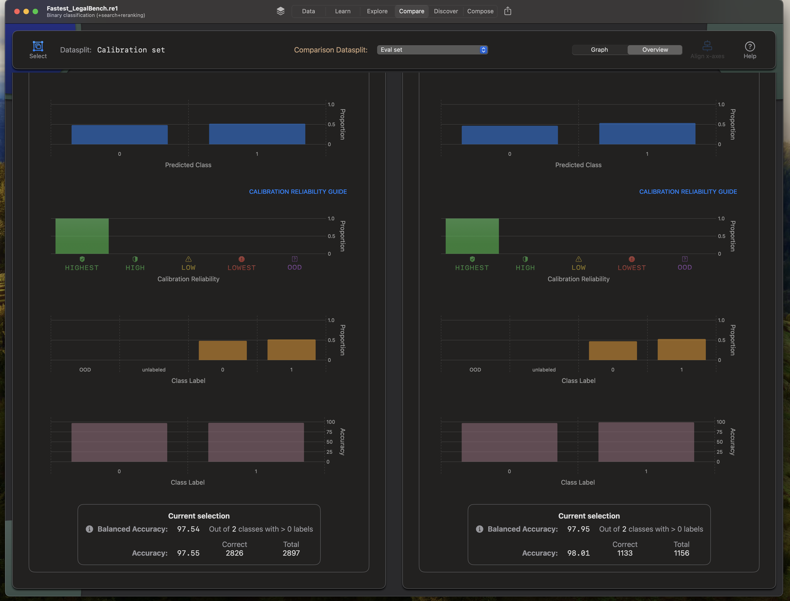

# Tutorial 8: Reexpress+GPT-4 unlocks the potential of AI for legal professionals

[Reexpress](https://re.express/) unlocks the potential of AI for legal professionals.

Using large language models (LLMs) as co-pilots to increase the productivity of lawyers, paralegals, and other legal professionals would seem, on first glance, to be an obvious application for AI. After all, the legal profession involves many time-consuming tasks that are inherently text-based, involving detail-oriented, systematic analyses of large bodies of text. LLMs would seem to be a good fit as domain-specific search engines for knowledge discovery and data comparisons, and as classifiers to check for human errors, such as typos and data omissions and inconsistencies, and errors arising from other semi-automated systems, such as from document OCR.

However, as with medicine and finance, LLMs remain largely out-of-reach for legal professionals due to their lack of reliability and robustness. The productivity gains of a legal co-pilot are greatly diminished if the end-user has no readily available means of verifying the reliability of the output and whether the model is going off-the-rails on distribution-shifted inputs. If the model is being used as an auxiliary error checker (i.e., running the model and comparing the output to the human decision to alert for possible mistakes), the time spent carefully verifying false positives of the model itself may outweigh the benefits. An inability to take actionable steps to locally course-correct the model further means that the same types of errors will appear ad nauseam. Without systematic observability, errors could be introduced into the workflow as the data shifts over time, and these errors may not be immediately evident to the end-users.

Reexpress fundamentally alters this calculus with its paradigm-shifting approach to LLM data analysis and constraining LLM outputs based on the observed data. In this way, Reexpress provides the modeling innovations that will enable the use of AI in professional services, such as law.

In this tutorial, we illustrate this behavior by combining Reexpress with GPT-4, evaluated over a subset of tasks in the recently proposed LegalBench benchmark [[1]](#references). In this way, we demonstrate that it is easy to combine Reexpress with GPT-4 to add reliable uncertainty estimates and interpretability capabilities over advanced reasoning tasks.

We provide the `.re1` model file with the trained model and data [here](https://drive.google.com/file/d/1TcfQjtiGdYSQyv-6wclhz8V316EsH4p9/view?usp=sharing). The model file is compressed as a `.zip` file, which is about 700 mb. Uncompress the file by double-clicking it in your Mac's Finder. The uncompressed `.re1` file is about 1.2 GB. This uses the smallest on-device model, **FastestDraft I**, a 640 million parameter model, so you should be able to open the file and explore the data on any Apple silicon Mac. If you download the `.re1` model, you can skip down to the section *'Analyzing the output'*. Otherwise continue for reference on how we created the `.re1` model file.

## LegalBench

LegalBench is a large, publicly available dataset for evaluating the legal reasoning capabilities of LLMs. We focus on the subset of 80 tasks structured as binary classification that also have an MIT or CC BY 4.0 license. In the data fold used below, the data is split with a Training set of 11,568 documents; a Calibration set of 19,280 documents; and an Eval set of 7,711 documents.

### OpenAI models

We use the base prompt provided in the LegalBench [repo](https://github.com/HazyResearch/legalbench). We run inference using `gpt-4-0125-preview`. Since the documents are much longer than the 512-token limit of the on-device models, we also run the `text-embedding-3-large` model over the input and the single token output (typically 'Yes' or 'No') of `gpt-4-0125-preview`. A simple transformation of the GPT-4 output logits and the embeddings are then combined into 32 floats used as Reexpression attributes attached to each document in the JSON lines file for input into Reexpress.   

See [preprocess/README.md](preprocess/README.md) for how to run inference with the OpenAI models and format the attributes in the JSON lines files. That basic setup can be used for other classification tasks, so you can use that as a starting point for your own data. However, for the purposes of this tutorial, you can skip the preprocessing step, as the preprocessed data with attributes is available for download [here](https://drive.google.com/file/d/1_GofjFb8g9sO9iDhgYvh_RS2eorsS_km/view?usp=sharing).

### Training Reexpress for legal reasoning

Create a new project in Reexpress. Choose the **FastestDraft I** (640 million parameter) model and use the following Template prompt: 

> Please classify the topic of the following document, explaining your reasoning step-by-step.

Import `train.legalbench.jsonl`, `calibration.legalbench.jsonl`, and `eval.legalbench.jsonl` as the Training, Calibration, and Eval sets, respectively.

After importing the above files, optionally upload the label display names file, `label_display_names.jsonl`.

Click **Learn**->**Train**->**Batch** and choose 200 epochs for `Model training` and `Model compression`. Scroll down and select the Eval set to automatically run post-training inference. And then start! This will take around 1 hour 15 minutes on an M2 Ultra 76-core GPU with 128 GB of memory. (Expect around 2x longer on an M1 Max with 64 GB of memory.) As noted above, you can skip this step by downloading the `.re1` file above.

## Analyzing the output

Go to **Compare** and **Select** the Calibration set. On our run, the Balanced Accuracy is 86. Choose the `Eval set` as the Comparison Datasplit in the dropdown in the top menu. Click **Overview**. We see that the distributions are similar in terms of the proportions of the partitions by Output Magnitude, Distance to Training, Similarity to Training, proportion of predictions by class, and the distribution of Calibration Reliability. 

In this case, we have the ground-truth labels for the `Eval set`. We see that the Balanced Accuracy of the Eval set is 86, as with the Calibration set. 

A Balanced Accuracy of 86 is promising, but for professional tasks, we need additional information. The marginal accuracy is not sufficiently informative alone, because in practice, we need to know if the new documents we see are among the subset for which the model is reliable. (See the previous tutorial for an example of the importance of controlling for distribution shifts, which can be difficult to detect without Reexpress as the co-pilot.) With Reexpress, unlike any other approach, it is simple to partition the data to produce a well-calibrated probability estimate for the prediction for each document. For example, we can restrict to the documents with a calibrated probability in [0.95, 0.99] among those in the Highest calibration reliability partition:

Since we have the ground-truth labels, we can confirm that the accuracy of both the Calibration set and the Eval set fall into our desired probability range. Here, both sets have an accuracy of 98.

The visual interface makes it easy to further examine the datasplits at the document level:

As we've seen in previous tutorials, we can also drill down further and perform matching at the document- and feature- levels to compare to the nearest documents in Training and other datasplits. This type of `interpretability by example/exemplar` can be very useful in enterprise tasks to see the labels and predictions for similar documents:

These tools are critical in practice, because as we saw in the previous tutorial, we otherwise would be flying blind as to whether the data is similar to what we have seen in the past, and whether the model can reliably predict over our new data. These capabilities are quite complicated to implement from scratch, but with Reexpress, these analysis tools are available without writing a single line of code!

To further drive this home, suppose we only saw the 426 Eval set documents with a calibrated probability in [0.01, 0.50]. Without Reexpress, we wouldn't know that the predictions over those documents would be no more reliable than simply flipping a coin!

Luckily, with Reexpress we would know ahead of time that those predictions are unreliable. Importantly, we would know this **without access to the ground-truth labels**. In such cases, we would know to not rely on the model. We might further consider labeling a subset of those documents, and then updating the on-device model by returning to the **Learn** tab. 

## Concluding remarks

GPT-4 is a remarkably powerful language model. However, as AI researchers and developers have observed over the last several months, there seems to be something missing from such LLMs --- not just GPT-4, but all such generative models. LLMs can work startlingly well on benchmarks and demos, while simultaneously being strikingly brittle. They can go unexpectedly off-the-rails on new data. For professional tasks, what mechanism would enable us to constrain such models to reliable outputs? **Answer: Reexpress**.

Reexpress is the missing piece that unlocks LLMs for professional settings. Reexpress provides the model observability and statistically robust guardrail constraints needed to use generative AI models in professional and enterprise settings.

## References

[1] Guha et al. 2023. "LegalBench: A Collaboratively Built Benchmark for Measuring Legal Reasoning in Large Language Models". [https://arxiv.org/abs/2308.11462](https://arxiv.org/abs/2308.11462). Data/code: [https://github.com/HazyResearch/legalbench](https://github.com/HazyResearch/legalbench).

## Acknowledgements

We thank Microsoft and OpenAI for providing startup cloud credits.

This brief tutorial is solely the responsibility of Reexpress AI, Inc., including any errors or omissions.

## Limitations

Keep in mind that our first product, Reexpress one, can only estimate a minimum probability of 0.01 and a maximum probability of 0.99. This is by design, as being a first version release, it is not intended for high-risk settings that require greater resolution.

This newfound ability to derive reliable estimates over high-dimensional objects does not obviate the need for careful considerations and assessments of risks and suitability for a given task. 
